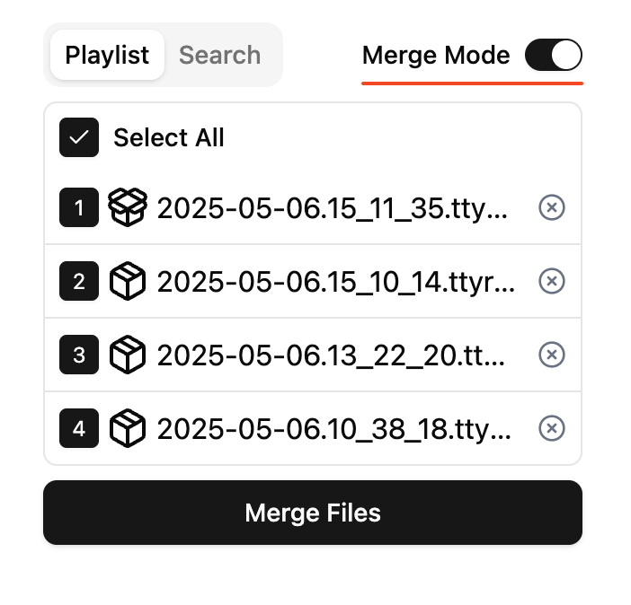

  <picture>
    <source media="(prefers-color-scheme: dark)" srcset="./logo-dark.png" />
    <source media="(prefers-color-scheme: light)" srcset="./logo-light.png" />
    
  </picture>

 

  

 

[Launch Player 📺](https://dcss-ttyrec-player.pages.dev/)

A ttyrec player with some additional features. Uses `Asciinema Player` as the core player.

Primarily developed for Dungeon Crawl Stone Soup playback, but should support all other ttyrec files as well.

## Features

- [x] Play .ttyrec and .ttyrec.bz2 files
- [x] Playlist
- [x] Search (supports regular expressions)
- [x] Merge multiple ttyrecs (works even when ttyrec and ttyrec.bz2 files are mixed)
  - [x] Download merged file
- [x] i18n - Korean, English
- [x] Cache bz2 unzipped results

### Search

<table border="0">
  <tr>
    <th>Search with Normal Text</th>
    <th>Search with Regular Expression</th>
  </tr>
  <tr>
    <td>
      
    </td>
    <td>
      
    </td>
  </tr>
</table>

- Currently case-insensitive.
- Clicking on search results jumps to the corresponding timestamp.
  - \*There may be a slight timing discrepancy of a few frames. Asciinema Player provides millisecond-level seeking, while ttyrec records down to microseconds. If text doesn't appear after clicking search results, use `,`, `.` keys to navigate through nearby frames.
- \*Some text may not be searchable. but mostly you can search for the desired text directly.
  - ttyrec updates only necessary parts of the text. For example, if an Oni worships Gozag and becomes "Oni the Gozag", it moves the cursor after "Oni" and adds "the Gozag". In this case, `the Gozag` is searchable but `Oni the Gozag` is not.

### Merge

<table border="0">
  <tr>
    <th>Enable Merge Mode</th>
    <th>Download Merged File</th>
  </tr>
  <tr>
    <td>
      
    </td>
    <td>
      
    </td>
  </tr>
</table>

- Use the merge mode toggle in the playlist's top-right corner to select and combine multiple ttyrec (or ttyrec.bz2) files. Files are merged in the order you check them.
- Download the merged file when processing is complete.
- \*When merging, the first file's start time is set to unix time 0, and the interval between files is set to 1 second. The unix time modification does not affect playback.

### Plans & Bug Reports

- Features or Improvements planned include adding files to existing playlists, loading ttyrec files from URLs, and more.
- Please report any bugs you encounter in [Issues](https://github.com/caiman-dorohedoro/dcss-ttyrec-player/issues).

### Inspired by

CNC server's ttyrec player (examples - go to https://archive.nemelex.cards/ttyrec/caiman and click "Play" button)
