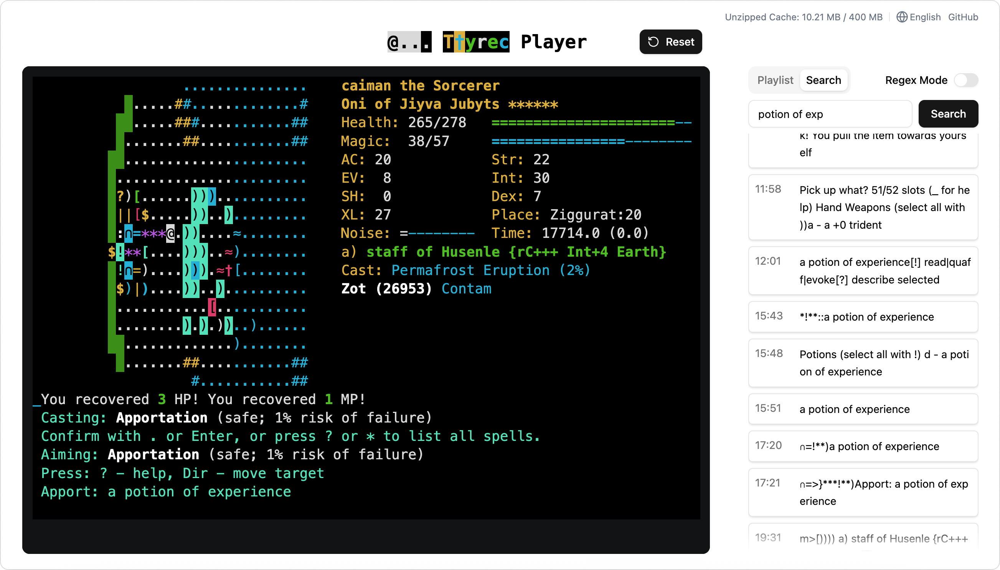

  <picture>
    <source media="(prefers-color-scheme: dark)" srcset="./dark-theme-logo.png" />
    <source media="(prefers-color-scheme: light)" srcset="./logo.png" />
    
  </picture>

## Screenshot

  

## Features

- [x] Play .ttyrec and .ttyrec.bz2 files
- [x] Playlist
- [x] Merge multiple ttyrecs (works even when ttyrec and ttyrec.bz2 files are mixed)
- [x] Search (!!, supports regular expressions)
- [x] i18n - Korean, English
- [x] Cache bz2 unzipped results

### Inspired by

CNC server's ttyrec Player (examples - https://archive.nemelex.cards/ttyrec/caiman)
